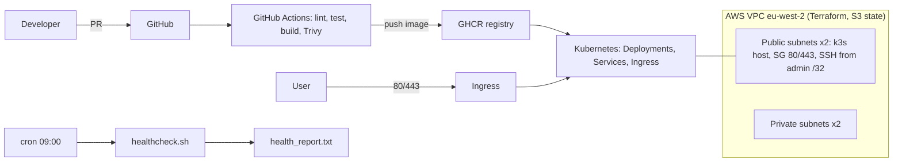

# Architecture

```mermaid
flowchart LR
  Dev[Developer] -->|PR| GH[GitHub]
  GH --> CI[GitHub Actions: lint, test, build, Trivy]
  CI -->|push image| GHCR[GHCR registry]
  GHCR --> K8s[Kubernetes: Deployments, Services, Ingress]
  User[User] -->|80/443| Ingress[Ingress] --> K8s
  subgraph AWS["AWS VPC eu-west-2 (Terraform, S3 state)"]
    Pub[Public subnets x2: k3s host, SG 80/443, SSH from admin /32]
    Priv[Private subnets x2]
  end
  K8s --- Pub
  Cron[cron 09:00] --> HC[healthcheck.sh] --> Report[health_report.txt]
```
